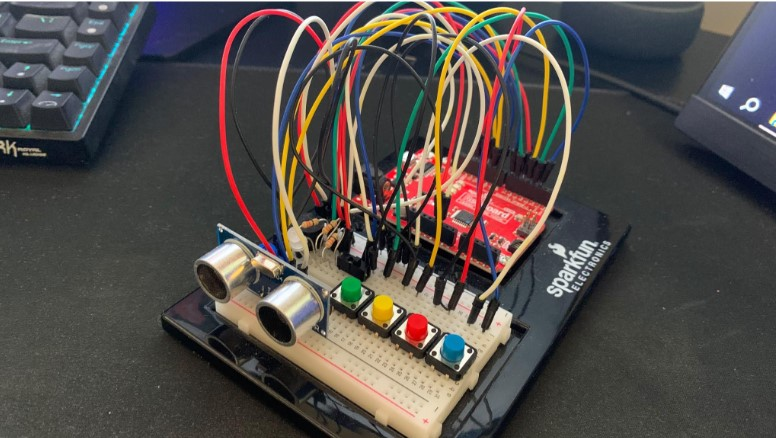

 

# arduino-instrument
A small embedded music system that allows users to record and play back musical sequences using physical controls, LEDs, a buzzer, and a distance sensor.

The project was designed around a hardware limitation: the robot only has a single buzzer for audio output. My initial goal was to support three simultaneous tracks for lead, bass, and drums. During development, memory constraints on the Arduino required reducing this to two tracks. The final implementation combines a lead and drum track during playback to simulate simultaneous instruments.

# Features
- Play notes using physical buttons
- Adjust note pitch using a distance sensor
- Record musical sequences
- Playback recorded tracks
- Combine multiple tracks during playback
- State-based control for play, record, selection, and playback modes
- LED feedback for the current operating state
- Simulated drum sounds using frequency patterns

# Hardware
- Arduino RedBoard
- Buzzer
- Push buttons
- Distance sensor
- LED
- Physical switch

# System Design
The robot uses a state-based control system to manage its different operating modes. User input from the buttons and switch determines state transitions, while the distance sensor and buttons provide reactive control during music playback and recording.

# Recording and Playback
One of the main design challenges was determining how to store recorded notes while preserving their timing.

My initial approach was to represent each track using a time-based array. Each position represented a fixed time interval, allowing the program to determine which instruments were playing at each point in time.

This approach had two major drawbacks:

- It required a large amount of memory.
- Fixed time intervals could not accurately represent when a user actually played a note.

I replaced this approach with an event-based representation. Each recorded note stores information about:

The note played
When the note started
The duration of the note

Silences are also represented so that playback preserves the timing of the original performance.

This allows the program to store only the events that actually occurred rather than allocating memory for every possible point in time.

# Combining Tracks
To play multiple tracks through a single buzzer, the program creates a timeline containing events from each track and orders them by their start time.

The initial implementation copied the note structures from each track into a separate array. After encountering the Arduino's memory limitations, I changed this to an array of pointers to the original note structures.

This reduced the memory required by the combined timeline while preserving the ability to sort and process notes from multiple tracks.

During playback, the program follows the combined timeline and switches between lead and drum sounds at their appropriate timestamps. Drum sounds briefly interrupt lead notes before playback resumes, creating the effect of multiple instruments playing simultaneously.

# Memory Constraints
Memory usage became one of the primary technical constraints of the project.

The original design targeted three tracks, but the Arduino could not store more than two tracks at the desired length. I optimized memory usage by:

- Reducing unnecessarily large data types
- Storing only required note information
- Replacing copied note structures with pointers
- Testing different track capacities against the available memory

The final implementation supports approximately 60 notes per track while remaining within the board's memory constraints.

Further memory optimization could allow longer recordings or additional tracks in a future version.

# Pitch Control
The distance sensor is used to expand the range of notes available from the four physical buttons.

Each button corresponds to a base note frequency. The measured distance is converted into a pitch offset and applied to that base frequency, allowing the user to produce a wider range of notes without requiring additional buttons.

# Control System
The robot uses a hybrid control approach combining reactive and deliberate behavior.

Reactive control is used when:

- Buttons trigger notes
- The distance sensor modifies pitch
- User input changes the robot's operating state

Deliberate control is used during recording and playback, where the robot maintains a timeline of recorded events and executes them at their recorded timestamps.

The system primarily relies on reactive control because state transitions are intentionally driven by the user's physical input.

# Future Improvements
Possible improvements include:
- Increase track capacity through additional memory optimization
- Support additional simultaneous tracks
- Improve drum sound synthesis
- Store more compact representations of recorded notes
